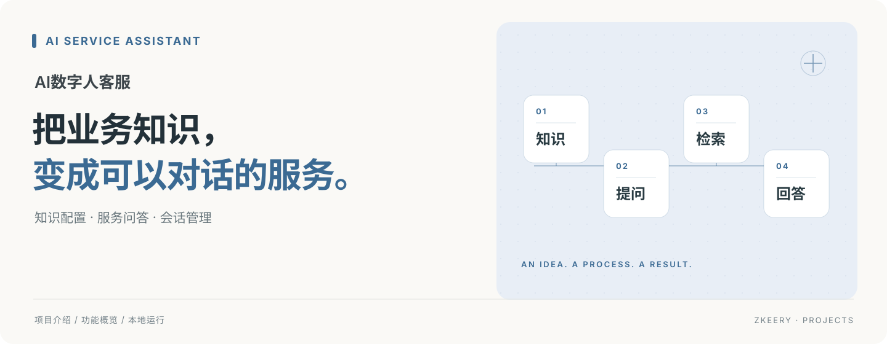

# AI数字人客服

**把零售金融的常见问题，变成有文字、有口播、有明确下一步的咨询体验。**

面向账户、银行卡、信用卡等咨询场景的本地演示项目。访客可以直接提问、阅读回复、听取口播，并在需要时选择转人工；维护者可以配置不同入口，查看本地会话与知识检索记录。

Next.js · React · FastAPI · SQLite

[快速启动](#快速启动) · [功能介绍](#可以做什么) · [使用文档](docs/README.md)

## 可以做什么

| 能力 | 具体体验 |
| --- | --- |
| 多入口咨询 | 通用金融咨询和信用卡专窗使用各自的欢迎语与形象配置 |
| 知识检索 | 可开启本地样例知识检索，为网点、办卡材料等问题提供参考依据 |
| 口播与字幕 | 浏览器朗读回复，配合立绘动效和字幕；支持关闭或跳过口播 |
| 会话管理 | 展示转人工提示、结束会话并收集评价，在本地面板查看统计 |

## 一次咨询怎么进行

1. 进入咨询页面，选择示例问题或直接输入问题。
2. 阅读回复；开启口播后，同时听取朗读。
3. 继续追问，查看启用检索后返回的样例依据。
4. 需要人工帮助时选择转人工，结束当前会话。

## 快速启动

准备 Python 3.12 和 Node.js 22+。默认使用模拟回复，可先体验页面和会话流程。

```bash
git clone https://github.com/Zkeery/ai-digital-human-service.git
cd ai-digital-human-service
./start.sh
```

启动脚本会创建 Python 虚拟环境、安装后端依赖，并从 `.env.example` 生成本地配置。另开终端，在仓库根目录运行：

```bash
cd frontend
cp .env.local.example .env.local
npm ci
npm run dev
```

打开 [本地页面](http://127.0.0.1:3050)。后端默认地址为 `http://127.0.0.1:8050`。

需要真实文本回复时，在根目录 `.env` 配置 `LLM_API_KEY`、`LLM_BASE_URL` 和 `LLM_MODEL`，将 `LLM_MOCK=0` 后重启后端。知识检索默认关闭，可在本地「验收模式」中开启并查看命中记录。

## 当前边界

当前交付为本地咨询演示。口播使用浏览器语音与立绘动效，实时数字人视频链路仍待接入验证；转人工保留交互和会话状态，未连接真实坐席。内置知识是演示样例，不读取真实账户，也不办理转账、查余额或授信。

## 继续了解

配置、体验清单与知识库说明见 [使用文档](docs/README.md)。
