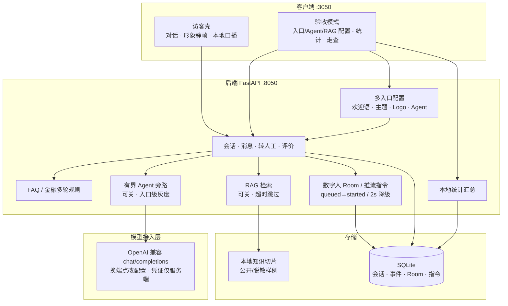
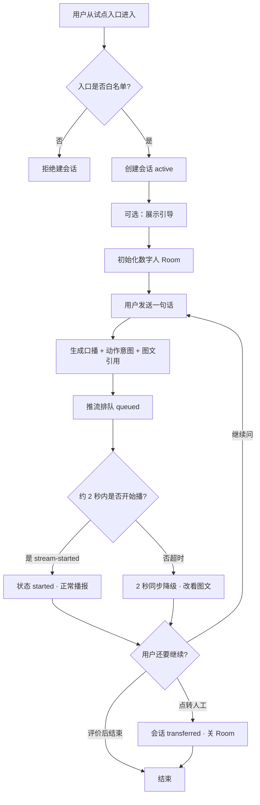
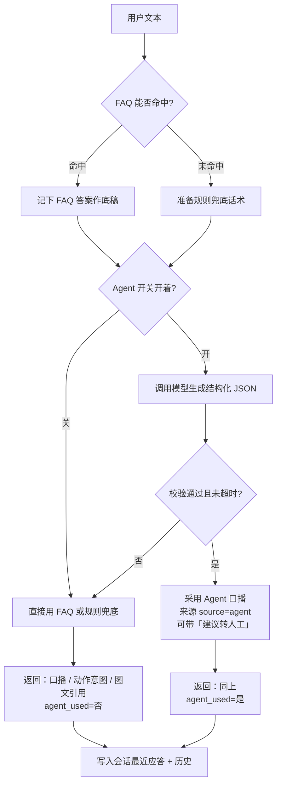

# PRD · AI数字人客服 Agent（方案级 V0.4）

## 文档信息

| 项 | 内容 |
| --- | --- |
| 文档名称 | AI数字人客服 Agent · 产品需求文档（方案级） |
| 版本 | V0.4 |
| 更新日期 | 2026-10-06（结构补齐与系统架构图）；正文交付事实截至 2026-10-03 |
| 负责人 | 小龙兰 |

基线：服务数字人 PRD V1.0。业务线（2026-10-02 锁定）：**零售金融客服**（账户／转账／卡片／密码／网点等咨询指引），**不是**电商售后，**不是**投顾荐股。交付状态（2026-10-03）：本地底座、金融多轮、正式前端试点，以及近程增强 **A1～C2**、**D1～D1.4（本地口播／静帧／静音／跳过）**、**E1～E7（RAG 扩样例）与 E2（本地播报动效）均已本地交付并确认**。**仍不上线（D9）**；真 RTC 另开 D2。一键回归：`projects/AI数字人客服/scripts/run_nearterm_regression.sh`。配套：同目录《PRD 补全清单》、`docs/阶段文档/近程增强-决策纪要.md`、`docs/阶段文档/近程增强路线图.md`、`docs/项目状态.md`、`docs/阶段文档/数字人技术接入方案.md`、`docs/阶段文档/核心业务流转图.md`。

## 1. 目标用户与核心任务

- **用户**：在 jtalk 场景咨询**零售金融业务问题**的 C 端客户。  
- **任务**：通过数字人形象＋语音／文字完成金融客服咨询；必要时转人工。  
- **内部用户**：运营配置分流与查看数字人会话／评价（近程先做**本地配置与统计面板**，不做现网运营台）。

## 2. 输入、过程、产物

| | 内容 |
| --- | --- |
| 输入 | 语音或文本；入口／FAQ 上下文；会话历史（有界）；近程增加**入口配置**与**知识切片检索** |
| 过程 | 分流引导 → 唤醒数字人 → 多轮问答（口播＋图文；可选 RAG）→ 评价／转人工 |
| 产物 | 已播报口播、图文记录、会话标记、评价数据；近程增加入口维度统计 |
| 长期保留 | 与现网 jtalk 客服会话／评价策略一致（正式上线后再对齐） |

## 3. Agent 主链路

**固定编排为主，Agent 为可选旁路：**

1. 分流与唤醒：确定性系统完成（近程支持**多入口**配置）。  
2. 应答：NLP／FAQ／金融多轮规则为主；Agent 可生成口播文本与动作意图（需校验）；近程可叠加 **RAG 检索片段**（须校验、可关）。  
3. 推流与同步：数字人系统完成。  
4. 转人工／结束：业务规则＋指令 ID，**不交给模型自主决定是否转人工执行**（模型仅可建议）。

**必须由确定性代码／人工确认的动作（金融高风险）：**

- 转人工执行、关闭数字人服务、变更分流／入口配置、变更知识库生效范围  
- **不得**由模型自主：发起转账、改密、挂失／解挂、改预留手机、代客购买／赎回理财、承诺收益或保证到账时间

## 4. 系统架构

本节概括本机试点架构，依据 `docs/阶段文档/数字人技术接入方案.md`、`docs/阶段文档/核心业务流转图.md` 与仓库代码核对。前端端口 **3050**，后端端口 **8050**；本阶段仅 `127.0.0.1` 本地联调，不上公网（D9）。方案级现网仍复用 jtalk 会话／分流／Room／RTC；本仓库落地为本地访客壳＋验收面板＋有界 Agent／RAG 旁路。

### 4.1 系统架构概览

### 4.2 主业务流程

整段会话（鸟瞰），对齐 `docs/阶段文档/核心业务流转图.md`：

一句话如何变成口播（问答 + Agent）：

推流同步与 2 秒降级：指令进入 `queued` 后，默认 hold ≈ 2000ms；客户端回报 `stream-started` 则标为 `started`；**超时场景**（含 check-sync 发现仍 `queued` 且超过 hold）记 `dh_sync_fallback_2s`、指令标 `skipped`，前端改展示图文／在线客服路径。转人工：**建议转人工**可由 Agent 提出；**真正转走**必须点转人工接口，会话 `status=transferred` 并关闭 Room（见 §8）。

### 4.3 模块职责

| 模块 | 职责 |
| --- | --- |
| 前端访客壳（3050） | 零售金融对话 UI、形象静帧、本地口播／跳过、复制与聚焦等本地体验；不展示入口／Agent／RAG 配置 |
| 前端验收模式（3050） | 入口选择、Agent 总闸、RAG 开关、本地口播开关、统计面板、走查快捷句、形象选择等联调控件 |
| 会话／消息 API | 建会话（白名单入口）、发消息、快照恢复、评价；仅 `active` 可继续对话 |
| FAQ／金融多轮 | 确定性规则应答；电商售后相关模块为历史代码，**非现行需求**（见 §6） |
| 有界 Agent | 可选旁路：生成结构化口播／动作意图／建议转人工；总闸 ∧ 入口级启用；失败／超时静默回退规则 |
| RAG | 本地切片检索增强口播；可关；超时跳过；材料仅公开／脱敏样例；门禁样例见 `rag_gate_cases.json` |
| 数字人服务 | Room 生命周期、推流指令队列（queued／started／skipped）、特殊指令、2s 同步降级 |
| 多入口配置 | ≥2 本地入口：欢迎语、theme、accent、logo_url、入口级 `agent_enabled` |
| 本地统计 | 本机库汇总会话／转人工／Agent／按入口分布；仅验收可见 |
| 模型接入层 | OpenAI 兼容 `chat/completions`；凭证仅服务端；无 Key／无预算不发起真实调用 |
| SQLite | 会话、事件、Room、推流指令等本地持久化 |

更细方案边界见 [数字人技术接入方案](../阶段文档/数字人技术接入方案.md)；流转细图见 [核心业务流转图](../阶段文档/核心业务流转图.md)。

## 5. 什么算「好」

- 口播可懂、**表述准确**（路径清楚、边界清楚；禁止含糊措辞）  
- **无错误承诺**（尤其收益、额度审批结果、到账时刻）  
- 图文与口播一致  
- 失败能降级到图文／在线客服  
- 不泄露其他用户数据  
- 涉及资金／身份操作时，只给**自助路径说明或建议转人工**，不代替用户操作  
- **RAG**：只引用已入库公开材料；答不出时明确说「未找到依据」或回退规则话术，不编造政策  

数字标准：结构合法沿用既有基线；**金融话术**以样例打分冻结——五维（路径准确／边界清楚／不含糊／可执行／合规）平均 ≥ 2，且无「不能接受」项（见 `docs/evidence/后端阶段30-金融话术样例打分/`）。RAG 命中／未命中／拒答样例已冻结（见 `backend/app/knowledge/rag_gate_cases.json` 与近程 C2）。

## 6. 业务范围（零售金融）

### 6.1 做（咨询指引）

| 优先级 | 场景（示例） | 说明 |
| --- | --- | --- |
| P0 | 账户／余额／流水怎么查 | 只指路自助入口，不查真账 |
| P0 | 转账失败／未到账 | 澄清常见原因＋留证／转人工 |
| P0 | 银行卡绑定／解绑／挂失引导 | 只说明路径，不执行挂失 |
| P0 | 登录／密码／验证码 | 自助找回路径；锁户建议转人工 |
| P1 | 信用卡／额度／还款日 | 说明怎么查；不批额 |
| P1 | 理财产品说明书解读 | **只解读已公开材料**；不荐股、不承诺收益 |
| P1 | 网点／营业时间 | FAQ／短指引；近程可被 RAG 增强 |
| P1 | 投诉／纠纷引导 | 先分类再给下一步或转人工 |

### 6.2 近程增强（本地，不上线）

| 优先级 | 能力 | 说明 |
| --- | --- | --- |
| N1 | 多入口 | 本地可配置 ≥2 个入口；入口可带欢迎语／主题／Agent 开关等 |
| N2 | 入口级换肤与 Agent 灰度 | 不同入口不同皮肤与是否启用 Agent；全局开关仍保留 |
| N3 | 统计分析 | 本地面板：会话量、转人工、Agent 使用、入口分布等（不接现网大盘） |
| N4 | RAG | 本地知识库切片检索增强口播；可关；材料仅公开／脱敏样例 |
| N5 | RAG 扩样例 | 信用卡／账户／转账／银行卡／登录密码／投诉等公开样例＋门禁（E1／E3～E7）；本地播报动效（E2） |

#### 6.2.1 多入口与换肤（A1／A2）

代码目录 `backend/app/services/entries.py`：至少 `entry_pilot_001`（通用金融咨询）、`entry_credit_001`（信用卡专窗）。字段含 `welcome_text`、`theme`、`accent`、`logo_url`、`agent_enabled`。Agent 实际启用＝**全局总闸 ∧ 入口 `agent_enabled`**。访客壳不渲染入口／Agent／RAG 配置控件；验收模式可选入口并预览换肤与「实际会／不启用 Agent」。

#### 6.2.2 本地统计面板（B1）

验收模式展示本机库汇总（`GET /api/v1/stats`）：`sessions_total`／`sessions_active`／`sessions_transferred`、`transfer_events`、`agent_used`／`agent_skipped`、`messages_replied`、`ratings`，以及按入口的 sessions／transferred／agent_used／agent_skipped。访客模式不显示。不是现网运营大盘。

#### 6.2.3 数字人口播链（D1～D1.4）

| 能力 | 行为（以代码为准） |
| --- | --- |
| 本地口播（D1） | 浏览器 `speechSynthesis` 朗读口播文本；角标「本地口播中」；**非现网 RTC** |
| 开场欢迎口播（D1.1） | 访客点「开始咨询」且无连带发送时朗读欢迎语 |
| 形象静帧（D1.2） | 形象 001–004 本地立绘；入口 Logo 为角标；非「DH」字母占位 |
| 静音／口播开关（D1.3） | **验收模式**可打开／关闭本地口播；关闭后不朗读。当前代码：访客模式本地口播固定开 |
| 跳过口播（D1.4） | 口播中（`speaking`）可点「跳过口播」立刻停止 |
| 本地播报动效（E2） | 口播中立绘忙碌动效＋声浪条＋底部字幕预览；跳过／关口播后消失 |

真数字人推流／现网引擎联调为 **D2**（待测试凭证），本期不承诺。

#### 6.2.4 RAG 实现边界（C1／C2／E）

- 开关：全局 `rag_enabled`（配置可改）；关闭则不检索。  
- 超时：默认约 `rag_timeout_seconds=0.5`；超时则跳过检索、走规则／FAQ，不阻塞会话。  
- 材料：本地 `pilot_chunks.json` 等公开／脱敏样例；不得入库未脱敏工单／客户隐私原文。  
- 结果：`hit`／`miss`／`timeout`／`disabled`；命中可附样例依据后缀；不编造政策／荐股／假数字。  
- 门禁：`backend/app/knowledge/rag_gate_cases.json` 与一键回归锁行为。

### 6.3 不做

- 电商售后话术（退货／物流／价保／缺货等）——历史样例见归档说明，**不再作为现行需求**  
- 真查账、真转账、真挂失、真改密、接核心／柜面系统  
- 投资建议、收益承诺、保证到账  
- **本期仍不上线**（公网域名、现网挂载、正式账号体系接入）  
- 未脱敏工单／客户隐私原文进入知识库  

#### 6.3.1 历史代码说明（电商售后模块）

后端 `backend/app/services/` 仍保留部分电商售后多轮文件（如 `return_dialogue`、`logistics_dialogue`、`refund_dialogue`、`stock_dialogue`、`warranty_dialogue`、`price_protect_dialogue`、`coupon_dialogue`、`invoice_dialogue`、`payment_dialogue` 等）。此类为**业务线纠正前的历史代码残留**，**不属于现行零售金融需求**；现行应答以金融多轮／FAQ／RAG 样例为准。清理或归档排期：待补充。

## 7. 页面与字段

本机正式前端：`http://127.0.0.1:3050/`（Next.js）；对接后端 `http://127.0.0.1:8050`。单页工作台，模式切换：访客／验收。

| 区域 | 模式 | 主要字段／控件 | 说明 |
| --- | --- | --- | --- |
| 顶栏／配置条 | 访客 | 标题「零售金融客服」；口播相关以代码为准（访客固定开） | 不展示入口／Agent／RAG 配置 |
| 顶栏／配置条 | 验收 | 入口选择、Agent 总闸、RAG 开关、本地口播开／关、形象 001–004 | 配置预览「实际会／不启用 Agent」 |
| 数字人区 | 共用 | 形象静帧、状态角标、入口 Logo 角标、口播字幕预览 | 非现网直播 |
| 对话区 | 共用 | 欢迎语、用户／客服气泡、快捷回复、复制对话 | 金融开场与多轮选项 |
| 操作 | 共用 | 开始咨询、发送、转人工、评价、跳过口播（口播中） | 转人工须确认 |
| 验收辅助 | 仅验收 | 走查快捷句、本地统计面板 | 访客不可见 |
| 后端联调页 | 可选 | `http://127.0.0.1:8050/` 静态联调 | 与正式前端并存；不上线 |

入口视图字段（API `EntryView`）：`id`、`label`、`welcome_text`、`theme`、`accent`、`logo_url`、`agent_enabled`。消息应答字段（`MessageResponse`）：`spoken_text`、`action_intent`、`graphic_template_ref`、`agent_used`、`suggest_transfer_human`、`source`、`sync_hold_ms`、`quick_replies` 等。

## 8. 会话状态与可做的事

会话状态以 `backend/app/services/sessions.py` 与 `SessionRow.status` 为准：

| 状态 | 含义 | 可做 | 不可做 |
| --- | --- | --- | --- |
| `active` | 会话进行中 | 发消息、初始化／推流数字人、评价、点转人工 | — |
| `transferred` | 已执行转人工 | 查看状态；Room 已关 | 再发消息、再推流（`SESSION_NOT_ACTIVE`） |

相关对象状态（非会话主状态）：

| 对象 | 状态值 | 说明 |
| --- | --- | --- |
| Room | `active`／`closed` | 初始化后 active；转人工或回收后 closed；活跃 Room 有上限（配置 `room_active_limit`，默认 30） |
| 推流指令 | `queued`／`started`／`skipped` | 排队 → 开始播；超时降级或跳过则为 skipped |

「建议转人工」（`suggest_transfer_human=true`）**不等于**已转人工；只有调用转人工接口后会话才变为 `transferred`。

## 9. 内容安全与合规

汇总产品红线（来源见括号）：

| 红线 | 要求 | 来源 |
| --- | --- | --- |
| 资金／身份操作 | 模型不得自主转账、改密、挂失／解挂、改预留手机、代客买卖理财；只给自助路径或建议转人工 | §3、§5 |
| 承诺类表述 | 禁止收益承诺、保证到账时刻、保证额度审批结果 | §5、§6.1 |
| 转人工执行 | 仅确定性接口／人工确认；模型最多建议 | §3、§4.2、§8 |
| 配置与知识库 | 变更分流／入口／知识库生效范围须确定性代码或人工确认 | §3 |
| 数据保护 | 按金融客服级别；日志不记完整证件号、完整卡号、密码、验证码；数据国内不出境；不得用于模型训练 | §12 |
| RAG 材料 | 仅公开／脱敏样例；未脱敏工单／隐私原文不得入库；答不出不编造 | §5、§6.2.4、§6.3 |
| 密钥与调用 | 凭证仅服务端；无 Key／无预算不得真实调用；月度模型费用上限见 §11 | §11 |
| 上线边界 | 本阶段不上公网、不接现网正式账号（D9） | §13 |

现网 jtalk／数字人引擎隔离与 Room 限流等方案级要求见 [数字人技术接入方案](../阶段文档/数字人技术接入方案.md) §1.3、§6。

## 10. 交付阶段与优先级

| 阶段 | 范围 | 当前 |
| --- | --- | --- |
| 方案评审 | 边界、接入、安全、Agent 设计 | ✅ |
| 底座 MVP | 单入口、Agent 可关、2s 降级、会话可恢复、正式前端试点 | ✅ |
| 金融话术替换 | 用零售金融多轮替换电商样例 | ✅（第21～29） |
| 前端本地体验收口 | 访客壳、复制、聚焦、走查辅助等 | ✅（前端第20～41） |
| **近程增强 A** | 多入口配置＋入口级换肤／Agent 灰度（本地） | ✅ A1／A2 |
| **近程增强 B** | 统计分析本地面板 | ✅ B1 |
| **近程增强 C** | RAG 本地可关检索＋样例门禁 | ✅ C1／C2 |
| **近程收口** | 一键回归＋走查清单近程节 | ✅ 本地加固 |
| **近程 D1** | 本地口播链（开场／应答／静音／跳过）＋形象静帧 | ✅ D1～D1.4 |
| **近程 E** | RAG 扩样例（信用卡／账户／转账／卡／登录／投诉）＋本地播报动效 | ✅ E1～E7／E2 |
| **近程收口（RAG）** | PRD／走查／一键回归写入 E 链 | ✅ RAG 扩样例加固 |
| **近程 D2** | 真数字人推流／现网引擎联调 | ⏳ 待测试凭证 |
| 上线 | 现网挂载、账号、域名、权限隔离 | **暂缓（D9）** |

详细拆步见 [近程增强路线图](../阶段文档/近程增强路线图.md)。

## 11. 模型与成本

- 厂商：不锁定；须国内合规可用。  
- 接入形态：OpenAI 兼容 HTTP 接口（配置 `llm_base_url` 等）；不在需求中绑定单一云厂商品牌。  
- 成本上限：单月模型费用 ≤ ¥500（或等价次数）；超限须人工确认。  
- 无 Key／无预算时不得发起真实调用。  
- RAG Embedding／检索调用计入同一月度上限，或单独报产品经理确认。

## 12. 数据与非功能

- 含用户咨询内容，按**金融客服**数据级别保护；日志不记完整证件号、完整卡号、密码、验证码。  
- **数据必须国内、不出境；不得用于模型训练。**  
- 时延：以现网数字人体验为基线；保住 2s 图文降级；RAG 超时则跳过检索走规则。  
- 并发：受数字人 Room 配额约束；**引擎按现网**；新供应商另 POC。  
- **入口**：近程由「仅 1 个白名单」扩展为**本地多入口白名单列表**（正式现网多入口仍随上线阶段）。

## 13. 上线与账号

- **本阶段仍不上线。**  
- 正式上线时跟随 jtalk 账号与权限体系。  
- 近程所有能力仅在 `127.0.0.1` 本地联调。

## 14. 功能范围对照（相对基线）

| 能力 | 基线 | 本 PRD（V0.4） |
| --- | --- | --- |
| C 端蒙层／输入／打断／同步 | 有 | 保持；**入口级换肤近程做（本地）** |
| 分流（FAQ／入口） | 有 | **多入口近程做（本地）** |
| 会话标记／评价 | 有 | 保持 |
| AI Agent 编排 | 无 | 有界旁路，可关；**入口级灰度近程做** |
| 咨询业务线 | （基线未锁行业） | **零售金融客服** |
| RAG／统计 | 暂无 | **近程做（本地）；上线暂缓** |

## 15. 埋点骨架

| key | 含义 |
| --- | --- |
| dh_guide_show | 引导展示 |
| dh_init_success / fail | 初始化结果 |
| dh_sync_fallback_2s | 2s 降级 |
| dh_agent_used / skipped | Agent 是否使用 |
| dh_transfer_human | 转人工 |
| dh_rate | 评价提交 |
| dh_entry_selected（近程） | 选用了哪个入口 |
| dh_rag_hit / miss / skip（近程） | RAG 命中／未命中／跳过 |

## 16. 验收用例

转写自交付表与 `docs/MVP/产品走查清单.md`（近程 N1～N16 已确认）。不编造新的通过结果；下列「结果」列沿用走查清单已记录状态。

| # | 检查项 | 期望 | 结果 | 来源 |
| --- | --- | --- | --- | --- |
| 1 | 打开 3050 开始咨询 | 有零售金融欢迎语 | 待走查勾选 | 走查 #1 |
| 2 | 「查余额」 | 账户指引／选项，无查真账承诺 | 待走查勾选 | 走查 #2 |
| 3 | 「办信用卡」 | 信用卡澄清选项，不批额 | 待走查勾选 | 走查 #3 |
| 4 | 「怎么退货」 | 明示不做网购售后 | 待走查勾选 | 走查 #4 |
| 5 | Agent 关 | 仍能走规则多轮 | 待走查勾选 | 走查 #5 |
| 6 | 点转人工并确认 | 会话为 transferred，不能再发 | 待走查勾选 | 走查 #6 |
| 7 | 评价弹层 | 可打分提交或跳过 | 已确认 | 走查 #7 |
| N1 | 验收模式本地入口 | ≥2 入口；访客看不见配置 | 已确认 | A1 |
| N2 | 换入口换肤＋Agent | 欢迎语／Logo／主色变化；总闸∧入口 | 已确认 | A2 |
| N3 | 本地统计面板 | 验收可见汇总；访客无 | 已确认 | B1 |
| N4 | RAG 可关 | 开有样例依据；关无；不编造荐股 | 已确认 | C1／C2 |
| N5～N9 | 本地口播链 | 口播／开场／静帧／开关／跳过 | 已确认 | D1～D1.4 |
| N10～N16 | RAG 扩样例＋动效 | 各场景有依据且边界话术正确；E2 动效 | 已确认 | E1～E7／E2 |
| D2 | 真 RTC／现网引擎 | 待测试凭证 | 未开始 | §10 |
| D9 | 上线 | 本阶段不做 | 暂缓 | §10、§13 |

日常锁绿：`./scripts/run_nearterm_regression.sh`。

## 17. 来源与修订

- 来源：[服务数字人 PRD V1.0](https://cm9ck7xvqw.feishu.cn/wiki/YtwIwnNXoiZVEsk0wHXc9ORwn0g)  
- 2026-10-01：方案级首版；V0.2——五问按推荐关闭；进入本地 MVP  
- 2026-10-02：**V0.3——业务线纠正为零售金融客服**；电商售后样例退出现行需求，进入归档待代码替换  
- 2026-10-03：**V0.4——除上线外，多入口／换肤与 Agent 灰度／统计／RAG 纳入近程本地交付**；上线仍暂缓（D9）  
- 2026-10-03：近程 A1～C2 确认；本地加固一键回归落地；上线仍暂缓  
- 2026-10-03：近程 E1～E7／E2 确认；RAG 扩样例收口写入交付表；上线仍暂缓；D2 待凭证  
- 2026-10-06：结构补齐——文档信息、系统架构（概览＋主流程 Mermaid＋模块职责）、页面与字段、会话状态、内容安全、验收用例；补薄 A1／A2／B1／D1／RAG；标明电商售后模块为历史代码；版本号仍为 V0.4  
