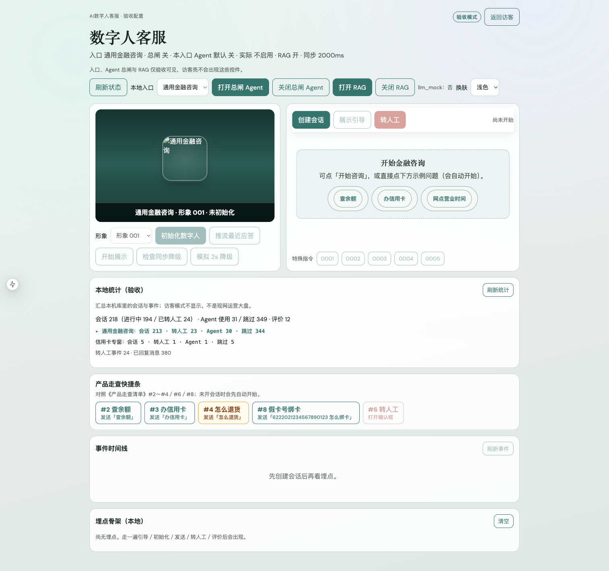
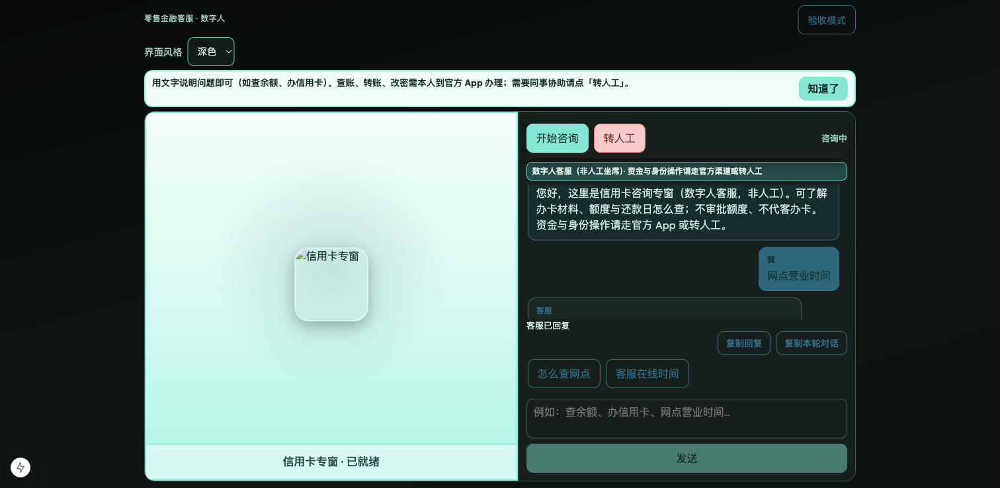

# 证据 · 近程 A1（多入口配置）

> 技术文档：[近程A1-多入口配置-技术开发文档](../../阶段文档/近程A1-多入口配置-技术开发文档.md)

## 自动化

| 项 | 命令／结果 |
| --- | --- |
| 后端多入口 | `pytest tests/test_stage39_multi_entry.py` → **通过**（2026-10-03） |
| 前端 | `npm test` → **41/41** 通过（2026-10-03） |

## 请产品经理手测（照着点）

1. 打开 http://127.0.0.1:3050/ ，强制刷新（Mac：`Cmd + Shift + R`）  
2. **访客模式**  
   - [x] 看不到「本地入口」  
   - [x] 看不到「打开／关闭总闸 Agent」  
   - [x] 「开始咨询」可用，能出欢迎语  
3. 切到 **验收模式**  
   - [x] 能看到「本地入口」下拉（通用金融咨询／信用卡专窗）  
   - [x] 能看到「打开／关闭总闸 Agent」  
4. 选「信用卡专窗」→「创建会话」  
   - [x] 顶栏说明出现「信用卡专窗」  

## 截图

### 验收：本地入口与总闸控件

### 访客：无管理控件

## 阶段闸门是否表（摘要）

见技术文档第七节；手测项已勾选并附截图。

## 结果

- 自动化：已过  
- 手测：已确认（2026-10-03；含截图）
