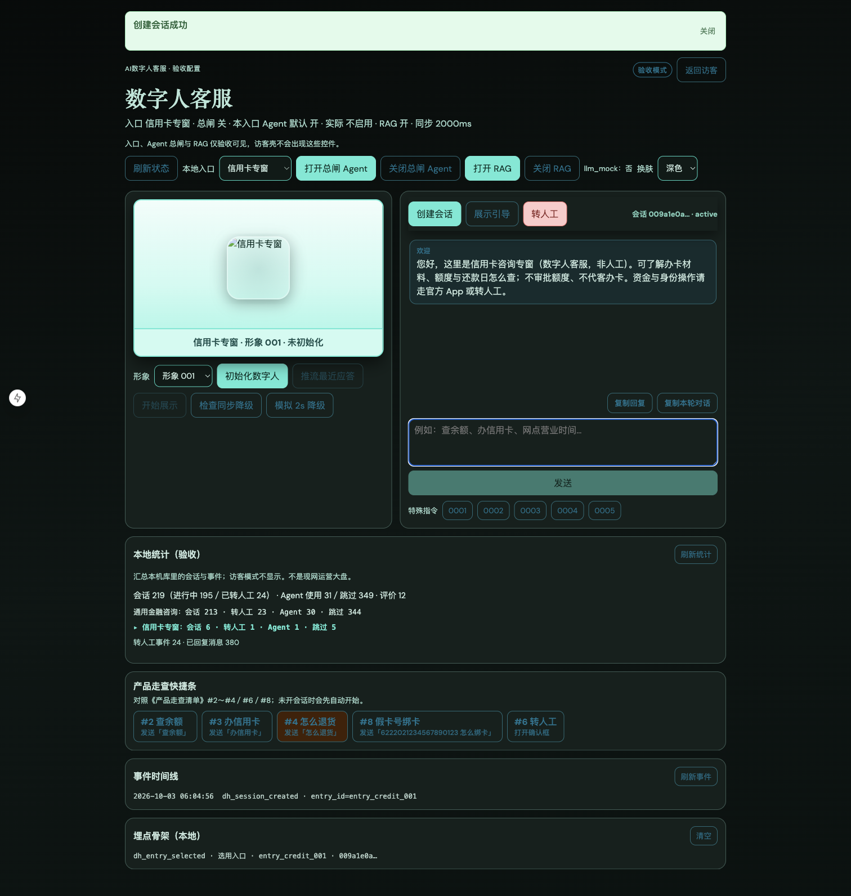

# 证据 · 近程 A2（入口换肤与 Agent 灰度）

> 技术文档：[近程A2-入口换肤与Agent灰度-技术开发文档](../../阶段文档/近程A2-入口换肤与Agent灰度-技术开发文档.md)

## 自动化

| 项 | 命令／结果 |
| --- | --- |
| 后端入口＋Agent 门闸 | `pytest backend/tests/test_stage39_multi_entry.py backend/tests/test_stage40_entry_agent_gate.py` → **8/8 通过**（2026-10-03） |
| 前端 | `npm test` → **43/43** 通过（2026-10-03） |

## 请产品经理手测（照着点）

1. 打开 http://127.0.0.1:3050/ ，强制刷新（Mac：`Cmd + Shift + R`）  
2. 右上角切到 **验收模式**  
3. 「本地入口」选 **信用卡专窗** → 点「创建会话」  
   - [x] 欢迎语含「信用卡咨询专窗」  
   - [x] 数字人画面出现专窗 Logo（青蓝风格）  
   - [x] 顶栏：本入口 Agent 默认 **开**；总闸关时「实际 **不启用**」；总闸开时「实际 **会启用**」  
4. 「本地入口」改 **通用金融咨询** → 再「创建会话」  
   - [x] 欢迎语恢复通用金融文案  
   - [x] Logo 换成通用标识；主色与专窗可区分  
   - [x] 顶栏：本入口 Agent 默认 **关**；即使总闸开，仍「实际 **不启用**」  
5. 切回 **访客模式**  
   - [x] 看不到「本地入口」和「打开／关闭总闸 Agent」  
   - [x] 「开始咨询」有默认入口欢迎语与 Logo  

## 截图

### 信用卡专窗会话（换肤 + Agent 灰度顶栏）

> 访客无管理控件见 [近程 A1 `guest-no-admin.png`](../近程A1-多入口配置/guest-no-admin.png)；通用入口控件见 [近程 A1 `lab-entry-controls.png`](../近程A1-多入口配置/lab-entry-controls.png)。

## 阶段闸门是否表（摘要）

见技术文档第七节；手测项已勾选并附截图。

## 结果

- 自动化：已过（2026-10-03）  
- 手测：已确认（2026-10-03；含截图）
