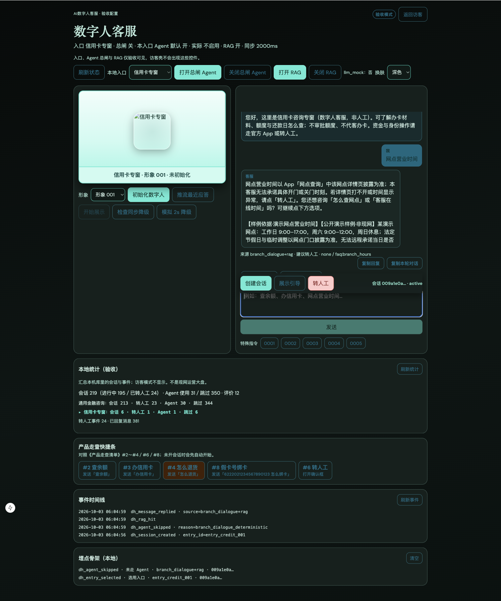

# 证据 · 近程 B1（统计本地面板）

> 技术文档：[近程B1-统计本地面板-技术开发文档](../../阶段文档/近程B1-统计本地面板-技术开发文档.md)

## 自动化

| 项 | 命令／结果 |
| --- | --- |
| 后端汇总 | `pytest backend/tests/test_stage41_lab_stats.py` → **2/2 通过**（2026-10-03） |
| 前端文案 | `npm test -- tests/stats-view.test.ts` → **通过**（2026-10-03） |

## 请产品经理手测（照着点）

1. http://127.0.0.1:3050/ 强制刷新（`Cmd + Shift + R`）  
2. **访客模式**  
   - [x] 看不到「本地统计（验收）」  
3. **验收模式**  
   - [x] 能看到「本地统计（验收）」与「刷新统计」  
4. 用两个入口各开一次会话，发一句；其中一个点转人工  
5. 点「刷新统计」  
   - [x] 总会话数 ≥ 2  
   - [x] 按入口两行有各自数字  
   - [x] 已转人工／转人工事件有增加  

## 截图

### 验收：本地统计面板（含入口分项与当前入口高亮）

> 访客无统计面板见 [近程 A1 `guest-no-admin.png`](../近程A1-多入口配置/guest-no-admin.png)。

## 结果

- 自动化：已过  
- 手测：已确认（2026-10-03；含通用／信用卡刷新与高亮；含截图）
