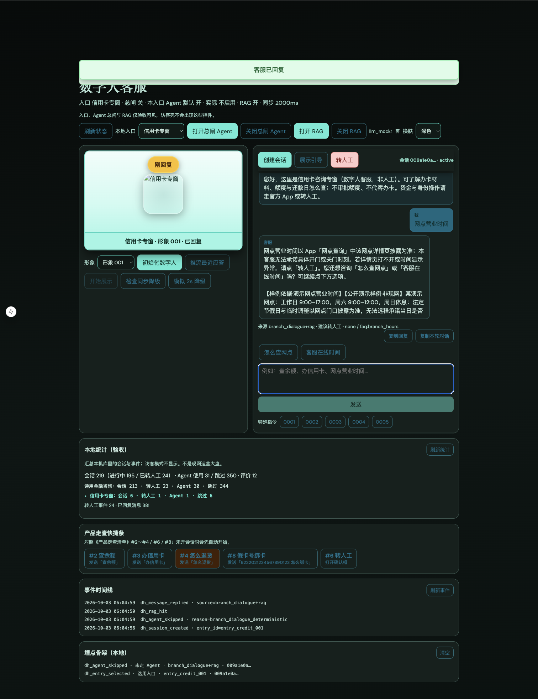

# 证据 · 近程 C1（RAG 最小闭环）

> 技术文档：[近程C1-RAG最小闭环-技术开发文档](../../阶段文档/近程C1-RAG最小闭环-技术开发文档.md)

## 自动化

| 项 | 命令／结果 |
| --- | --- |
| 后端 RAG | `pytest backend/tests/test_stage42_rag_pilot.py` → **7/7 通过**（2026-10-03） |
| 网点／理财回归 | stage26／27 仍通过 |
| 前端 | `npm test` → 通过（2026-10-03） |

## 请产品经理手测（照着点）

1. http://127.0.0.1:3050/ 强制刷新  
2. **访客模式**  
   - [x] 看不到「打开／关闭 RAG」  
3. **验收模式** →「打开 RAG」→ 创建会话  
4. 问「网点营业时间」或点网点相关走查  
   - [x] 口播含「样例依据」／演示网点字样  
   - [x] 事件里有 `dh_rag_hit`  
5. 「关闭 RAG」再问同样问题  
   - [x] 仍有规则答，无新样例依据  
6. 问无关闲聊 → 不编造网点／理财政策  

## 截图

### RAG 命中：网点营业时间 + 样例依据

> 事件时间线 `dh_rag_hit` 见 [近程 C2 `events-rag-hit.png`](../近程C2-RAG样例与门禁/events-rag-hit.png)。

## 结果

- 自动化：已过  
- 手测：已确认（2026-10-03；含截图）
