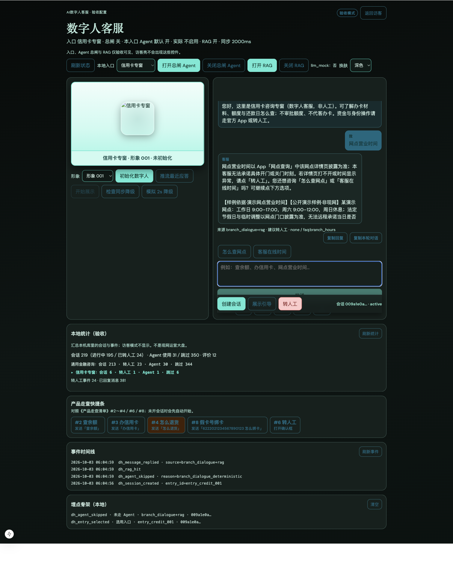

# 证据 · 近程 C2（RAG 样例与门禁）

> 技术文档：[近程C2-RAG样例与门禁-技术开发文档](../../阶段文档/近程C2-RAG样例与门禁-技术开发文档.md)  
> 冻结样例：`backend/app/knowledge/rag_gate_cases.json`

## 自动化

| 项 | 命令／结果 |
| --- | --- |
| 门禁 | `pytest backend/tests/test_stage43_rag_gate.py` → **2/2 通过**（2026-10-03） |
| 可选脚本 | `backend/scripts/run_rag_gate.py` |

覆盖：H1／H2 命中、M1 未命中、R1／R2 拒答边界。

## 请产品经理抽查（照着点）

1. http://127.0.0.1:3050/ 强制刷新 → 验收模式 →「打开 RAG」  
2. [x] H1：问「网点营业时间」→ 有「样例依据」  
3. [x] M1：问「财富管理师推荐哪只好股票」→ 不荐股、不编造保证收益  
4. [x] R1：问「收益怎么理解」→ 强调不等于承诺收益  

## 截图

### 事件时间线：`dh_rag_hit`

> H1 口播「样例依据」全文见 [近程 C1 `rag-hit-branch-hours.png`](../近程C1-RAG最小闭环/rag-hit-branch-hours.png)。M1／R1 由门禁自动化 + 产品经理抽查确认。

## 结果

- 自动化：已过  
- 手测：已确认通过（2026-10-03；含截图）
