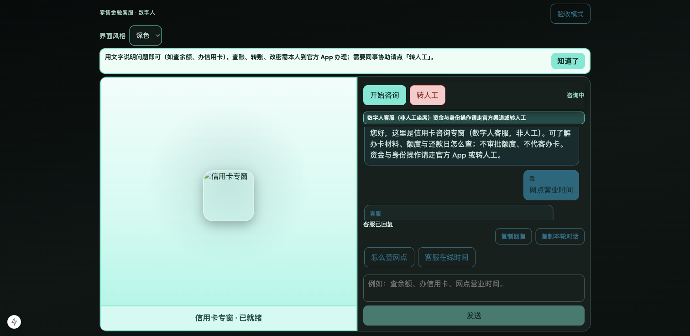

# 证据 · 近程收口（本地加固）

> 技术文档：[近程收口-本地加固-技术开发文档](../../阶段文档/近程收口-本地加固-技术开发文档.md)

## 自动化

| 项 | 命令／结果 |
| --- | --- |
| 一键回归 | `./scripts/run_nearterm_regression.sh` → **通过**（2026-10-03） |
| 后端 stage39～43 | **19/19** |
| 前端 `npm test` | **44/44** |

## 文档

- [产品走查清单](../../MVP/产品走查清单.md) 已含近程 N1～N4  
- [PRD](../../PRD/PRD.md) 近程阶段表已标 ✅；上线仍暂缓  

## 截图

### 访客主路径壳层（收口对照）

> 近程分项截图索引：  
> - [A1](../近程A1-多入口配置/) · [A2](../近程A2-入口换肤与Agent灰度/) · [B1](../近程B1-统计本地面板/) · [C1](../近程C1-RAG最小闭环/) · [C2](../近程C2-RAG样例与门禁/)

## 结果

- 自动化：已过  
- 产品确认：按推荐推进本地加固（2026-10-03）  
- 证据截图：已补齐并勾选手测项（2026-10-03）
