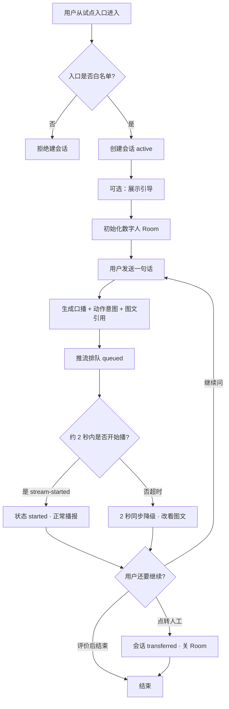
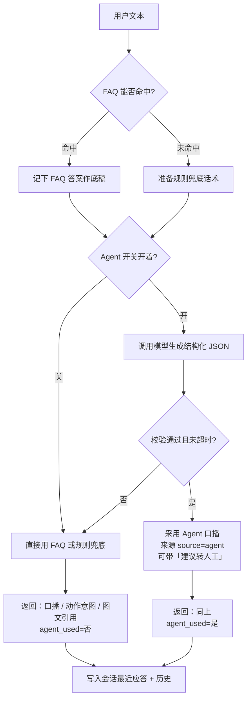
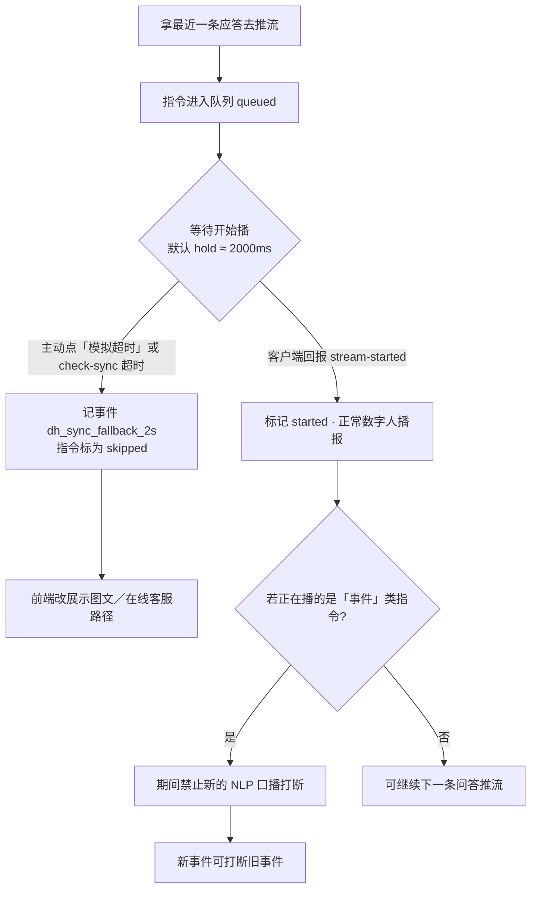
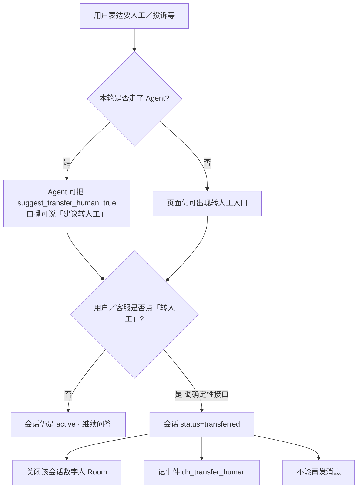

# 核心业务流转图｜问答 · Agent · 降级 · 转人工

> 对应本机试点实现（联调页 http://127.0.0.1:8050/ · 前端 http://127.0.0.1:3050/）。  
> **业务线**：零售金融客服。行业多轮规则替换中；底座流转如下。  
> 「建议转人工」≠「已经转人工」：前者可由规则／Agent 提出，后者必须点转人工接口。  
> 资金／身份类操作不得由模型自主执行。

---

## 一、整段会话（鸟瞰）

---

## 二、一句话怎么变成口播（问答 + Agent）

要点（产品话）：

| 情况 | 用户听到什么 |
| --- | --- |
| Agent 关 | 只走 FAQ／固定兜底，不花钱调模型 |
| Agent 开且成功 | 模型润色／生成口播；仍不能自己执行转人工 |
| Agent 开但失败／超时 | 静默跳过 Agent，退回 FAQ／兜底，会话不停 |

---

## 三、推流同步与「2 秒降级」

两种降级入口（效果同类）：

1. 联调页「模拟 2s 超时」→ 直接记降级事件  
2. `check-sync`：队列里还有 `queued` 且超过 hold → 自动降级  

---

## 四、转人工（建议 vs 执行）

| 角色 | 能不能「真的转走」 |
| --- | --- |
| Agent／模型 | 不能，最多建议 |
| 转人工按钮／接口 | 能，改会话状态并关 Room |

特殊指令 `0002`（转接告知）属于**事件播报**，仍不等于执行转人工。

---

## 五、一条完整幸福路径（例子）

1. 白名单入口建会话 → 引导 → 初始化 Room  
2. 用户：「怎么退货？」→ FAQ／Agent 出口播  
3. 推流排队 → 2 秒内开始播 → 用户听数字人  
4. 若一直不开始播 → 降级看图文  
5. 用户：「转人工」→ 仅当点击转人工后会话关闭数字人支路  

---

## 六、和联调页按钮的对应关系

| 你在页面上点的 | 对应上图哪一段 |
| --- | --- |
| 开／关 Agent | 第二节开关 |
| 发送消息 | 第二节整段 |
| 初始化数字人／推流 | 第三节排队 |
| 模拟 started | 第三节正常播 |
| 模拟超时／检查同步 | 第三节降级 |
| 转人工 | 第四节执行 |
| 特殊指令／换肤 | 旁路能力，不改主问答逻辑 |
